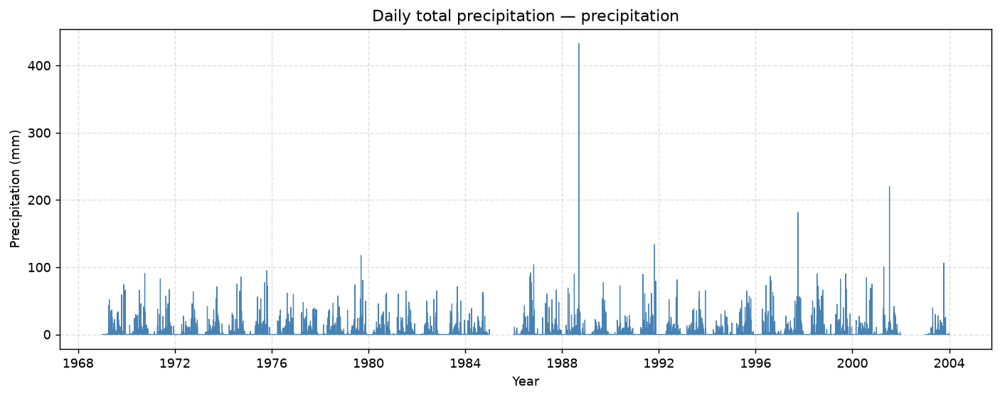
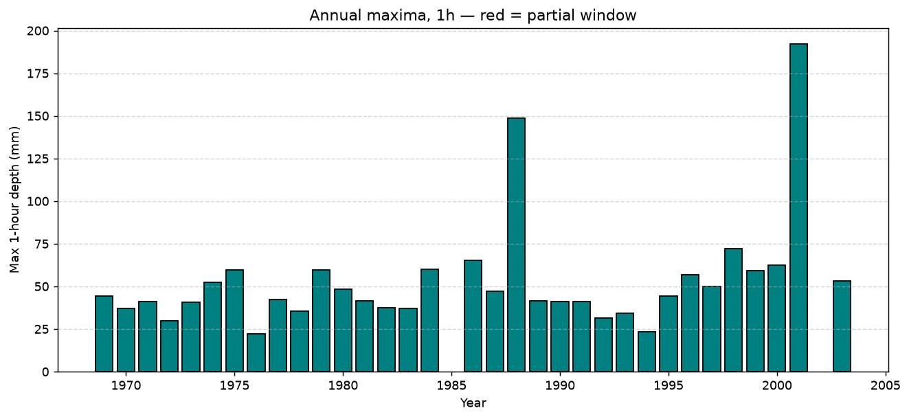
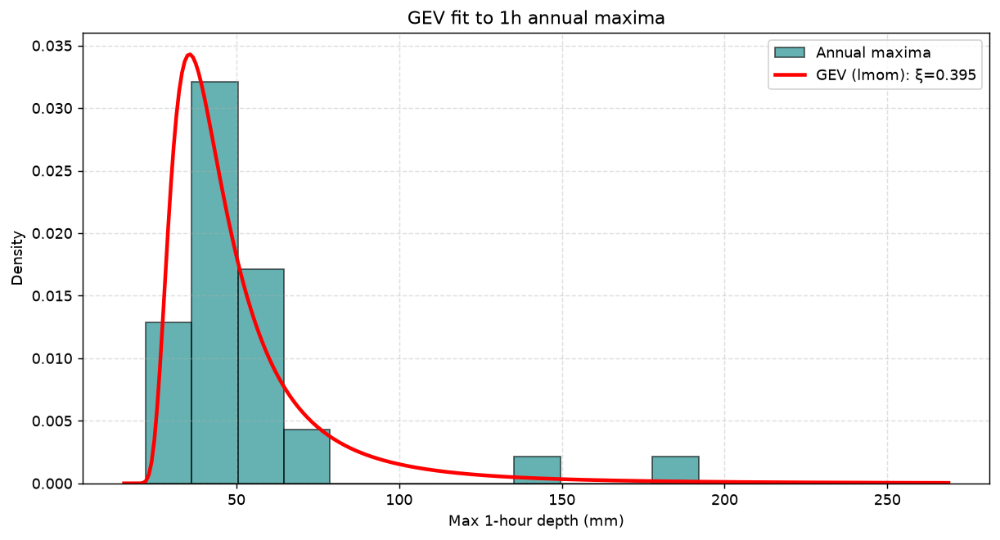
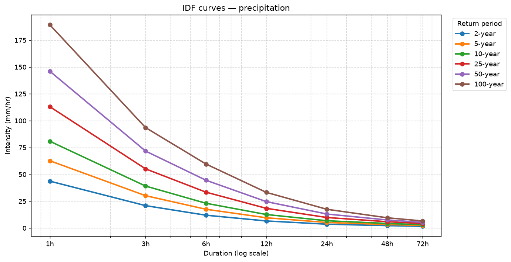
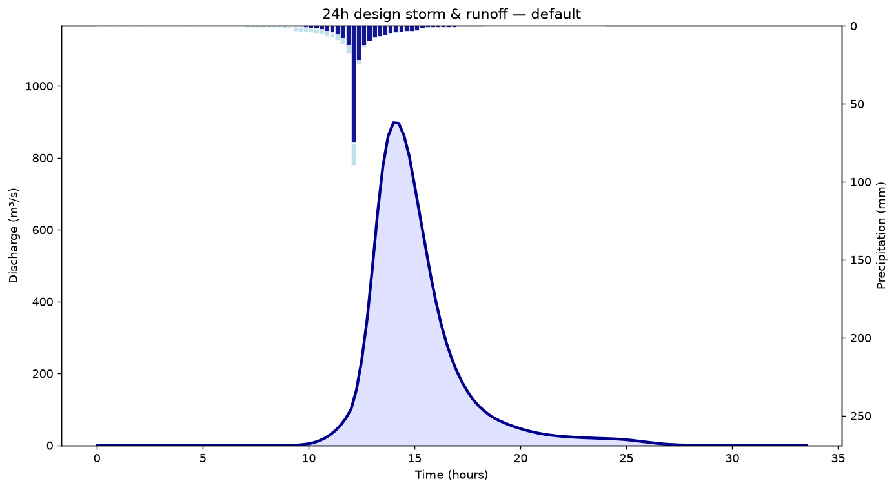
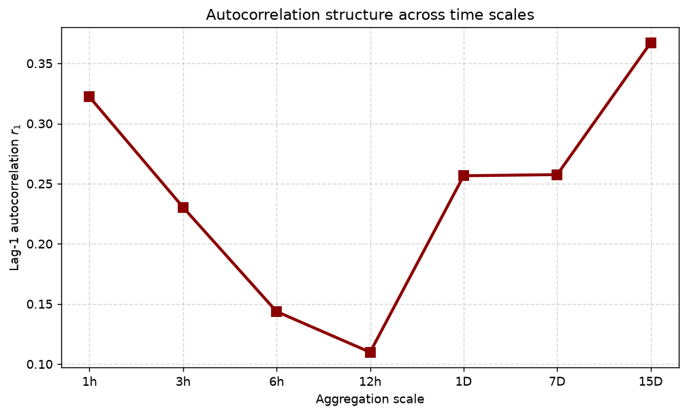
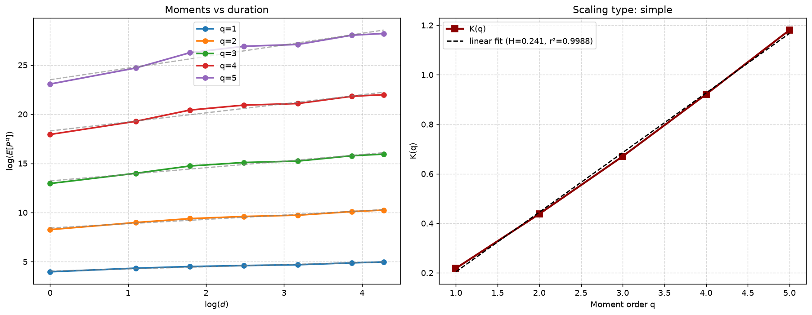

# Precipitation analysis — precipitation

Record 1969-01-01 to 2003-12-31 · config `67712533c266` · fit `lmom`

## 1. Data quality, basic statistics, P(dry), time series

| metric            | value               |
|:------------------|:--------------------|
| pct_missing       | 5.994941197945192   |
| n_hours_expected  | 306792              |
| n_hours_present   | 288400              |
| n_sentinel_masked | 0                   |
| n_complete_years  | 33                  |
| n_rejected_years  | 2                   |
| rejected_years    | 1985,2002           |
| first_year        | 1969                |
| last_year         | 2003                |
| n_valid           | 288400              |
| mean_mm           | 0.11186234396671291 |
| variance          | 1.7093814740517665  |
| std_mm            | 1.3074331623650084  |
| cv                | 11.68787561571268   |
| prob_dry          | 0.954611650485437   |
| l1                | 0.11186234396671291 |
| l2                | 0.11048553790881649 |
| lcv               | 0.9876919613064239  |
| l3                | 0.1077981570441906  |
| t3_lskew          | 0.9756766277696564  |
| l4                | 0.10392744857036618 |
| t4_lkurt          | 0.9406430066542945  |

## 2. Annual maxima series (hourly)

Monotonic across durations: **True**

|   year |   depth_mm |   window_completeness | end_time            |
|-------:|-----------:|----------------------:|:--------------------|
|   1969 |       44.5 |                     1 | 1969-12-14 17:00:00 |
|   1970 |       37   |                     1 | 1970-08-08 20:00:00 |
|   1971 |       41   |                     1 | 1971-05-28 17:00:00 |
|   1972 |       30   |                     1 | 1972-09-16 23:00:00 |
|   1973 |       40.5 |                     1 | 1973-09-27 04:00:00 |
|   1974 |       52.4 |                     1 | 1974-07-28 20:00:00 |
|   1975 |       59.6 |                     1 | 1975-10-22 00:00:00 |
|   1976 |       22.1 |                     1 | 1976-08-23 18:00:00 |
|   1977 |       42.2 |                     1 | 1977-04-23 21:00:00 |
|   1978 |       35.5 |                     1 | 1978-05-21 21:00:00 |
|   1979 |       59.5 |                     1 | 1979-09-12 23:00:00 |
|   1980 |       48.2 |                     1 | 1980-09-20 22:00:00 |
|   1981 |       41.7 |                     1 | 1981-07-21 18:00:00 |
|   1982 |       37.3 |                     1 | 1982-09-14 21:00:00 |
|   1983 |       37   |                     1 | 1983-09-05 20:00:00 |
|   1984 |       60.2 |                     1 | 1984-09-26 00:00:00 |
|   1986 |       65.2 |                     1 | 1986-09-24 21:00:00 |
|   1987 |       47   |                     1 | 1987-08-04 18:00:00 |
|   1988 |      148.8 |                     1 | 1988-09-11 08:00:00 |
|   1989 |       41.7 |                     1 | 1989-09-03 21:00:00 |
|   1990 |       40.9 |                     1 | 1990-05-25 00:00:00 |
|   1991 |       41.1 |                     1 | 1991-09-12 22:00:00 |
|   1992 |       31.4 |                     1 | 1992-10-05 16:00:00 |
|   1993 |       34.3 |                     1 | 1993-05-26 21:00:00 |
|   1994 |       23.2 |                     1 | 1994-10-10 00:00:00 |
|   1995 |       44.2 |                     1 | 1995-06-04 19:00:00 |
|   1996 |       57   |                     1 | 1996-06-08 21:00:00 |
|   1997 |       50   |                     1 | 1997-10-01 00:00:00 |
|   1998 |       72.1 |                     1 | 1998-07-17 23:00:00 |
|   1999 |       59.3 |                     1 | 1999-10-01 02:00:00 |
|   2000 |       62.3 |                     1 | 2000-08-02 02:00:00 |
|   2001 |      192   |                     1 | 2001-07-14 10:00:00 |
|   2003 |       53.2 |                     1 | 2003-10-12 04:00:00 |

## 3. Statistics by aggregation scale

| scale   |   n_valid |   mean_mm |   variance |   std_mm |     cv |   prob_dry |
|:--------|----------:|----------:|-----------:|---------:|-------:|-----------:|
| 1h      |    288400 |    0.1119 |      1.709 |    1.307 | 11.69  |     0.9546 |
| 3h      |     96106 |    0.3322 |      7.7   |    2.775 |  8.352 |     0.9194 |
| 6h      |     48028 |    0.6646 |     19.27  |    4.39  |  6.606 |     0.8768 |
| 12h     |     24006 |    1.329  |     44.1   |    6.641 |  4.996 |     0.8129 |
| 1D      |     11974 |    2.58   |     75.63  |    8.697 |  3.371 |     0.6979 |
| 7D      |      1706 |   18.27   |   1024     |   32     |  1.752 |     0.3535 |
| 15D     |       795 |   39.15   |   2861     |   53.49  |  1.366 |     0.234  |

> COMMENTARY: describe how mean, CV and P(dry) change with scale, and why.

## 4. Distribution fitted to the annual maxima

|   duration_hr |     mu |   sigma |     xi |   KS p |
|--------------:|-------:|--------:|-------:|-------:|
|             1 |  39.18 |   11.5  | 0.3954 | 0.5281 |
|             3 |  56.13 |   16.68 | 0.4057 | 0.686  |
|             6 |  64.29 |   19.09 | 0.4499 | 0.828  |
|            12 |  71.53 |   20.07 | 0.469  | 0.8389 |
|            24 |  78.5  |   21.89 | 0.455  | 0.8623 |
|            48 |  96.71 |   32.34 | 0.3444 | 0.8609 |
|            72 | 107.7  |   36.48 | 0.3078 | 0.8504 |

> COMMENTARY: justify GEV (extremal types theorem) and the L-moment estimator.

## 5. Other methods of extracting extremes

> COMMENTARY: block maxima vs peaks-over-threshold vs r-largest. Pros/cons: data efficiency, threshold choice, independence, declustering, bias-variance.

## 6. Intensity-Duration-Frequency relationships

Monotonicity checks passed: **True**

|   duration_hr |   return_period_yr |   intensity_mm_hr |   depth_mm |
|--------------:|-------------------:|------------------:|-----------:|
|             1 |                  2 |            43.72  |      43.72 |
|             1 |                  5 |            62.72  |      62.72 |
|             1 |                 10 |            80.9   |      80.9  |
|             1 |                 25 |           113.1   |     113.1  |
|             1 |                 50 |           146.1   |     146.1  |
|             1 |                100 |           189.4   |     189.4  |
|             3 |                  2 |            20.91  |      62.72 |
|             3 |                  5 |            30.19  |      90.56 |
|             3 |                 10 |            39.15  |     117.4  |
|             3 |                 25 |            55.17  |     165.5  |
|             3 |                 50 |            71.73  |     215.2  |
|             3 |                100 |            93.58  |     280.7  |
|             6 |                  2 |            11.98  |      71.89 |
|             6 |                  5 |            17.53  |     105.2  |
|             6 |                 10 |            23.11  |     138.6  |
|             6 |                 25 |            33.46  |     200.8  |
|             6 |                 50 |            44.56  |     267.4  |
|             6 |                100 |            59.66  |     358    |
|            12 |                  2 |             6.63  |      79.56 |
|            12 |                  5 |             9.6   |     115.2  |
|            12 |                 10 |            12.64  |     151.7  |
|            12 |                 25 |            18.38  |     220.5  |
|            12 |                 50 |            24.62  |     295.5  |
|            12 |                100 |            33.23  |     398.8  |
|            24 |                  2 |             3.634 |      87.23 |
|            24 |                  5 |             5.232 |     125.6  |
|            24 |                 10 |             6.846 |     164.3  |
|            24 |                 25 |             9.856 |     236.6  |
|            24 |                 50 |            13.1   |     314.3  |
|            24 |                100 |            17.52  |     420.5  |
|            48 |                  2 |             2.278 |     109.3  |
|            48 |                  5 |             3.338 |     160.2  |
|            48 |                 10 |             4.305 |     206.6  |
|            48 |                 25 |             5.945 |     285.3  |
|            48 |                 50 |             7.558 |     362.8  |
|            48 |                100 |             9.597 |     460.6  |
|            72 |                  2 |             1.692 |     121.8  |
|            72 |                  5 |             2.461 |     177.2  |
|            72 |                 10 |             3.14  |     226.1  |
|            72 |                 25 |             4.255 |     306.3  |
|            72 |                 50 |             5.319 |     383    |
|            72 |                100 |             6.631 |     477.4  |

> COMMENTARY: how intensity falls with duration and rises with return period.

## 7. Synthetic hydrograph and runoff

**default** — area 50.0 km², CN 75.0, tc 3.0 h

|   total_rain_mm |   total_runoff_mm |   losses_mm |   runoff_coefficient |   S_mm |   Ia_mm |   Tp_hr |   Qp_unit_cms_per_mm |   uh_volume_correction |   uh_ordinates |   peak_q_cms |   time_to_peak_hr |   volume_m3 |   volume_error |   base_time_hr |   area_km2 |   cn |   tc_hr |
|----------------:|------------------:|------------:|---------------------:|-------:|--------:|--------:|---------------------:|-----------------------:|---------------:|-------------:|------------------:|------------:|---------------:|---------------:|-----------:|-----:|--------:|
|           314.3 |             231.5 |       82.84 |               0.7365 |  84.67 |   16.93 |   1.925 |                5.827 |                  1.083 |             40 |        897.9 |                14 |   1.157e+07 |              0 |          15.25 |         50 |   75 |       3 |

## 8. Uncertainties in the runoff estimate

> COMMENTARY: distribution choice, parameter uncertainty at n=33, missing data and window censoring, the assumed basin parameters, SCS-CN and UH structural assumptions, measurement error.

## 9. Automating over 10,000 files

> COMMENTARY: this package is the answer — see README.

## 10. Autocorrelation structure

| scale   |     r1 |
|:--------|-------:|
| 1h      | 0.3221 |
| 3h      | 0.2304 |
| 6h      | 0.1437 |
| 12h     | 0.1098 |
| 1D      | 0.2566 |
| 7D      | 0.2575 |
| 15D     | 0.3672 |

> COMMENTARY: why dependence strengthens with aggregation.

## 11. Scaling relationship

H = **0.2408**, linearity r² = **0.9988** → **simple**

|   q |    K_q |   intercept |     r2 |
|----:|-------:|------------:|-------:|
|   1 | 0.2184 |       4.046 | 0.9768 |
|   2 | 0.4379 |       8.427 | 0.9712 |
|   3 | 0.6707 |      13.22  | 0.9623 |
|   4 | 0.9214 |      18.3   | 0.9559 |
|   5 | 1.181  |      23.51  | 0.9528 |

> COMMENTARY: interpret simple vs multiscaling.
